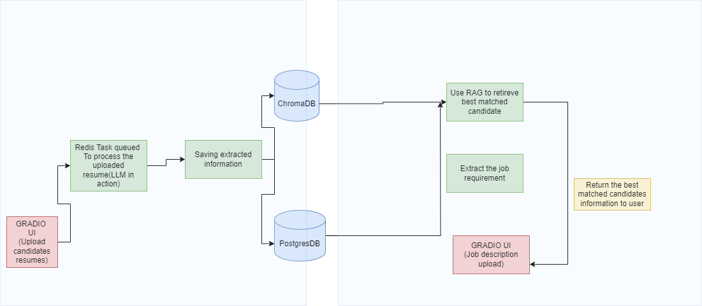

Candidate Resume Matching System
Overview

This project is a candidate resume management and job description matching system that utilizes LLM and RAG capabilities for processing resumes and matching candidates to job requirements. 
The system has following features: 

    Asynchronous Resume Processing:
        Resumes uploaded through a Gradio UI and are queued for processing by Redis service.
        This ensures users don't need to wait for one resume to finish processing before uploading the next.
        The processing extracts relevant information from resumes using an LLM (currently Ollama, but can be replaced by more powerful LLMs).

    Data Storage:
        ChromaDB: Stores vector embeddings for similarity-based searches.
        PostgreSQL: Stores candidate personal details.

    Job Description Matching:
        Users upload job descriptions through another Gradio UI.
        The system utilizes Retrieval-Augmented Generation (RAG) to find and display the top-matched candidates based on similarity scores and domain relevance.

Workflow
Resume Upload and Processing

    User uploads resumes through Gradio UI.
    Resumes are queued in Redis for asynchronous processing.
    An LLM processes each resume to extract:
        Candidate details (name, email, phone, etc.).
        Work experience, projects, skills, and other professional information.
    Extracted data is stored:
        Vector embeddings in ChromaDB.
        Personal details in PostgreSQL.

Job Description Matching

    User uploads a job description through the Gradio UI.
    The system determines the job's domain using LLM predictions.
    It retrieves top candidates from ChromaDB using RAG based on:
        Similarity scores (below 0.9 threshold).
        Matching domains.
    Best-matched candidates are displayed to the user through UI in tabular format.

Installation
Prerequisites

    Python 3.8+
    PostgreSQL installed and running.
    Redis installed and running(Docker)
    ChromaDB installed.

Future Improvements

    Integrate with more advanced LLMs for better information extraction.
    Enhance domain prediction with fine-tuned models.
    Introduce advanced filters for candidate retrieval.

Workflow Diagram

Candidates resume Upload UI

Find the best match

